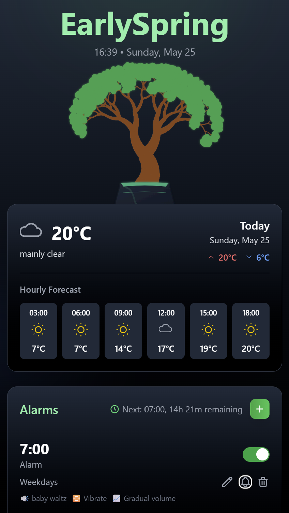
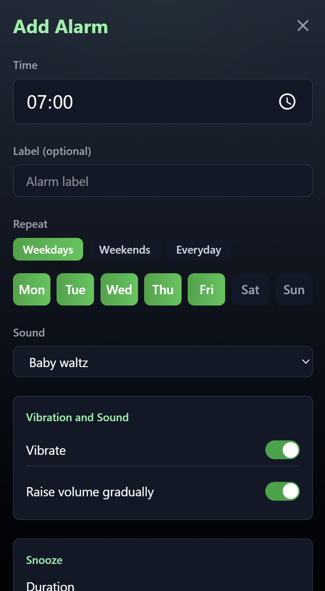
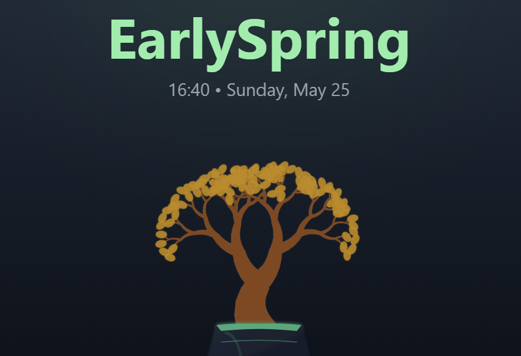

# EarlySpring 🌱

A modern, gamified alarm clock application that helps you build better wake-up habits through plant care mechanics and smart weather integration.

## (THIS IS A POC BUILD)

<center>

</center>

## Overview

EarlySpring transforms the traditional alarm experience by combining habit formation with gamification. Your virtual plant's health depends on your wake-up consistency, creating a compelling reason to maintain good sleep habits. The app features weather integration, customizable alarms, and a beautiful, intuitive interface.

## Features

### 🌱 Gamification
- **Virtual Plant System**: Your plant's health (0-100) and level (1-6) reflect your wake-up consistency
- **Progressive Growth**: Plants evolve from seedlings to ancient trees based on your habits
- **Health Rewards**: Waking up on time improves plant health (+10), while snoozing or ignoring alarms decreases it (-5 to -10)

### ⏰ Smart Alarms
- **Flexible Scheduling**: Set alarms for specific days (weekdays, weekends, or custom combinations)
- **Multiple Sound Options**: Choose from curated alarm sounds (Baby Waltz, Birds, Digital, etc.)
- **Advanced Settings**: Gradual volume increase, vibration, and customizable snooze behavior
- **Test Mode**: Preview alarms before they go live

### 🌤️ Weather Integration
- **Live Weather Data**: Displays current conditions and 6-hour forecast
- **Weather Alerts**: Optional weather announcements with your alarm
- **Location-Based**: Automatically detects your location for accurate forecasts
- **Smart Icons**: Dynamic weather icons that adapt to day/night conditions

### 🎙️ Text-to-Speech
- **Voice Announcements**: Speaks alarm labels and weather information
- **Dual TTS Support**: Browser-based TTS with API fallback for enhanced quality

### 🔐 Authentication
- **Google OAuth**: Secure sign-in with Google accounts
- **User Profiles**: Persistent data storage with MongoDB integration
- **Privacy Focused**: Minimal data collection, maximum security


<center>

</center>

## Tech Stack

### Frontend
- **React 18** with TypeScript
- **Tailwind CSS** for styling
- **Vite** for build tooling
- **Firebase Authentication** for user management

### Backend
- **Node.js** with Express.js
- **MongoDB** for data persistence
- **Docker** for containerization
- **Open-Meteo API** for weather data

### Additional APIs
- **HuggingFace TTS Models** for voice synthesis
- **Web Audio API** for sound playback
- **Geolocation API** for weather positioning

## Prerequisites

Before running EarlySpring, ensure you have:

- **Node.js** (v18 or higher)
- **Docker** and **Docker Compose**
- **Google Cloud Console** project for OAuth
- **Firebase** project for authentication
- **HuggingFace** account (optional, for enhanced TTS)

## Environment Variables

### Frontend (.env)
Create a `.env` file in the `earlyspring/` directory:

```env
VITE_GOOGLE_CLIENT_ID=your_google_client_id
VITE_GOOGLE_CLIENT_SECRET=your_google_client_secret

VITE_FIREBASE_API_KEY=your_firebase_api_key
VITE_FIREBASE_AUTH_DOMAIN=your_project.firebaseapp.com
VITE_FIREBASE_PROJECT_ID=your_firebase_project_id
VITE_FIREBASE_STORAGE_BUCKET=your_project.appspot.com
VITE_FIREBASE_MESSAGING_SENDER_ID=your_sender_id
VITE_FIREBASE_APP_ID=your_firebase_app_id

VITE_API_BASE_URL=http://localhost:3000/api
VITE_MONGO_DB_NAME=earlyspring
```

### Backend (backend/.env)
```env
PORT=3000
MONGO_URI=mongodb://mongodb:27017
MONGO_DB_NAME=earlyspring
FRONTEND_URL=http://localhost:5173
HUGGINGFACE_API_KEY=your_huggingface_api_key
```

### Docker Compose (.env)
Create a `.env` file in the root directory:
```env
MONGO_URI=mongodb://mongodb:27017/earlyspring
MONGO_DB_NAME=earlyspring
HUGGINGFACE_API_KEY=your_huggingface_api_key
```

## Installation

### Using Docker (Recommended)

1. **Clone the repository**
   ```bash
   git clone https://github.com/yourusername/earlyspring.git
   cd earlyspring
   ```

2. **Set up environment variables**
   ```bash
   cp .env.example .env
   # Edit .env with your configuration
   ```

3. **Start the application**
   ```bash
   docker-compose up -d
   ```

4. **Access the application**
   - Frontend: http://localhost:5173
   - Backend API: http://localhost:3000
   - MongoDB: localhost:27018

### Manual Installation

1. **Clone and setup**
   ```bash
   git clone https://github.com/yourusername/earlyspring.git
   cd earlyspring
   ```

2. **Install backend dependencies**
   ```bash
   cd backend
   npm install
   ```

3. **Install frontend dependencies**
   ```bash
   cd ../earlyspring
   npm install
   ```

4. **Start MongoDB**
   ```bash
   # Using Docker
   docker run -d -p 27017:27017 --name earlyspring-mongo mongo:latest
   ```

5. **Start the backend**
   ```bash
   cd backend
   npm run dev
   ```

6. **Start the frontend**
   ```bash
   cd ../earlyspring
   npm run dev
   ```
<center>

</center>

## App Components

### Core Components

#### Authentication System
- **Login Component**: Google OAuth integration with Firebase
- **AuthContext**: Global authentication state management
- **Protected Routes**: Route guards for authenticated content

#### Alarm Management
- **AlarmDashboard**: Main interface showing alarms, weather, and plant
- **AlarmForm**: Create and edit alarm configurations
- **AlarmList**: Display and manage multiple alarms
- **AlarmItem**: Individual alarm controls and settings
- **AlarmDisplay**: Full-screen alarm notification interface

#### Weather Integration
- **WeatherDisplay**: Current conditions and forecast
- **WeatherService**: API integration with Open-Meteo
- **Weather Icons**: Dynamic SVG icons for all conditions

#### Gamification
- **Plant Component**: Advanced SVG plant visualization with growth stages
- **Health System**: Points-based progression tracking
- **Level System**: 6-tier plant evolution (Seedling → Ancient Tree)

#### Utilities
- **AlarmScheduler**: Manages alarm timing and execution
- **TTS Service**: Text-to-speech with multiple engine support
- **Notification System**: Browser notifications and service worker

### Backend Services

#### API Endpoints
- **MongoDB Proxy**: RESTful database operations
- **TTS Proxy**: HuggingFace API integration
- **User Management**: Profile and plant data handling
- **Alarm CRUD**: Complete alarm lifecycle management

#### Data Models
- **User Schema**: Authentication and plant progress
- **Alarm Schema**: Comprehensive alarm configuration
- **Weather Schema**: Cached weather data structure

## Development

### Frontend Development
```bash
cd earlyspring
npm run dev        # Start development server
npm run build      # Build for production
npm run preview    # Preview production build
```

### Backend Development
```bash
cd backend
npm run dev        # Start with nodemon
npm start          # Start production server
```

### Docker Development
```bash
docker-compose up --build  # Rebuild and start
docker-compose logs -f     # View logs
docker-compose down        # Stop services
```

## Contributing

1. Fork the repository
2. Create a feature branch (`git checkout -b feature/amazing-feature`)
3. Commit your changes (`git commit -m 'Add amazing feature'`)
4. Push to the branch (`git push origin feature/amazing-feature`)
5. Open a Pull Request

## License

This project is licensed under the MIT License - see the [LICENSE](LICENSE) file for details.

---

**EarlySpring** - Wake up naturally, grow consistently 🌱✨
